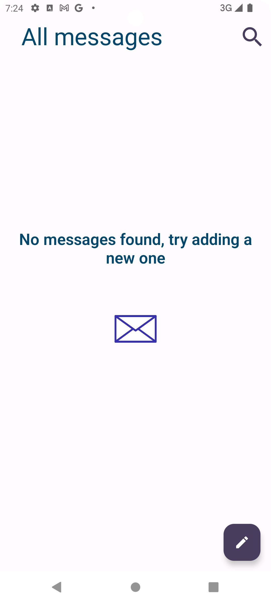
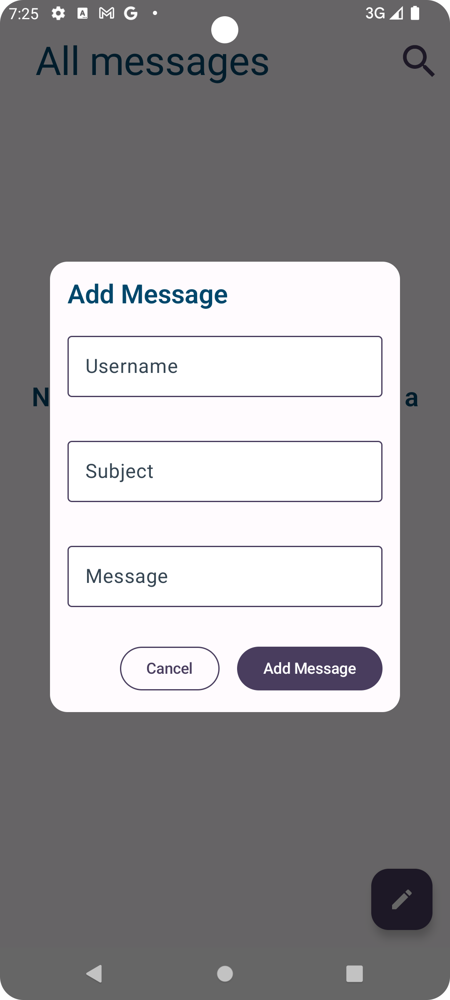
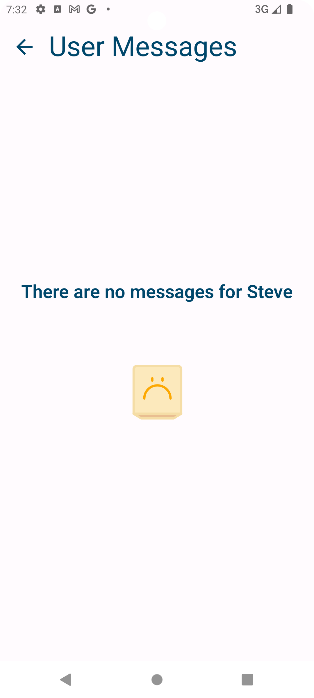

# README

## Message Manager

### Project Overview

The scope of this project is to build a native Android application that interacts with a REST API to POST and GET messages. The application is designed using modern Android development practices, including MVVM (Model-View-ViewModel) architecture, and utilizes Jetpack components and Kotlin coroutines for asynchronous operations.

### Screenshots








### Architecture

The application follows a Clean Architecture approach, with a clear separation between the UI, domain, and data layers.

- **Presentation Layer**:
  - **View (UI)**: Composable functions and UI components built with Jetpack Compose.
  - **ViewModel**: Handles UI-related data and business logic, communicating with UseCases.

- **Domain Layer**:
  - **UseCases**: Encapsulate specific business logic and interact with the repository.
  - **Repository Definitions**: Defines the contracts that will be use by the Repository Implementation.

- **Data Layer**:
  - **Repository Implementation**: Manages data operations, handling data sources (network, database).
  - **Data Sources**: API service for network operations.

### Design Decisions and Trade-offs

1. **Architecture Choice**: Clean Architecture ensures a scalable, maintainable, and testable codebase with a clear separation of concerns.
  - **Trade-off**: Increased initial complexity and development time.

2. **Jetpack Compose**: Used for building the UI due to its modern declarative approach and integration with Kotlin.
  - **Trade-off**: Learning curve and potential compatibility issues with older devices.

3. **Kotlin Coroutines**: Used for managing asynchronous tasks to simplify threading and improve readability.
  - **Trade-off**: Requires understanding of coroutines and proper handling of lifecycle.

4. **Dependency Injection**: Hilt is used for dependency injection to manage dependencies and improve testability.
  - **Trade-off**: Requires initial setup and understanding of Dagger/Hilt.

5. **Input Data Validation**: All input message fields (subject, username, message) are required to maintain consistency across the app, and prevent messages without a user or message. Blank spaces are also not allowed in the username, since it was impossible to retrieve those messages using the search by username endpoint.
  - **Trade-off**: It is not possible to have messages with a username like John Doe (with a blank space).

5. **Display messages**: The home screen of the application displays messages grouped by user in separate cards. This design choice was made because the message list endpoint's response lacked a predefined key for the username, resulting in each username becoming a unique key. Consequently, a Map data structure was used to identify each key and obtain the message list for each user. Therefore, the decision to maintain the grouping using user cards was based on the response structure and is reflected in the visual representation on the application's home screen. (While it is possible to flatten the list of messages within the list of cards, I believe that the current approach would help keep all the information organized.)

  - **Trade-off**: It is not possible to view a single list with all the messages.

### UI Design

1. **Home Screen**: Display a list of messages.

2. **Add Message Dialog**:Allows the user to input a new message.

3. **Search User Messages Dialog**: Allows the user to search messages by username.

4. **User Messages Screen**: Displays a list of messages for a specific user.

### Test Plan

Verify that the application correctly interacts with the REST API to POST and GET messages.

**Scope**

- Testing the POST operation to add a message.
- Testing the GET operation to retrieve all messages.
- Testing the GET operation to retrieve messages by username.
- Testing possible errors on input validation

**Test Strategy**

- Use manual testing for initial validation.
- Implement automated tests using JUnit for unit tests

**Valid Test Data**
- User names: "dan", "bob"
- Subjects: "pets", "bob stuff"
- Messages: "cats are grumpy", "dogs are happy", "bob bob bob"

**Invalid Test Data**
- User names: "john doe", ""
- Subjects: "",
- Messages: ""

**Manual Testing**:

- **Post Message**:
  - Click on the FAB button located in the lower right corner of the home screen
  - Enter valid data (user, subject, message) for all the fields in the dialog, and click on the Add Message Button.
  - Verify that a card is successfully added to the list of cards on the home screen (Each card groups all the messages of a specific user.)


- **Get multiple messages by user**:
  - Post a first message following the steps explained in the previous case.
  - Post a second message using the same user as the previous case.
  - Verify that the message count per user is incremented in the top right corner of the card on the home screen.

- **Get multiple messages by user**:
  - Post a first message following the steps explained in the previous case.
  - Post a second message using the same user as the previous case.
  - Verify that the message count per user is incremented in the top right corner of the card on the home screen.

- **Show all the messages of a user**:
  -  Add at least one message following the steps in the previous cases.
  - Click on the "All Messages" button located in the bottom right corner of a user's card in the home screen
  - Verify that the user's messages screen is displayed, showing all of their messages

- **Search messages by username**:
  -  Click on the search button located in the upper right corner of the screen.
  - Enter the username in the dialog that appears
  - Click on the search button
  - Verify that the user's messages screen is displayed, showing all the messages of that user

- **Search messages for a user that doesn't exist**:
  -  Click on the search button located in the upper right corner of the screen.
  - Enter a username that doesn't have any messages
  - Click on the search button
  - Verify that the user's messages screen is displayed, indicating they don't have any messages.

- **Invalid search**:
  -  Click on the search button located in the upper right corner of the screen.
  - Leave the username field blank
  - Click on the search button
  - Verify that an error message is displayed


- **Empty fields when posting a message**:
  - Click on the FAB button located in the lower right corner of the home
    screen
  - Leave one or multiple fields (user, subject, message) blank in the dialog
  - Click Add Message Button
  - Verify that an error message is displayed

- **Invalid username data when posting a message**:
  - Click on the FAB button located in the lower right corner of the home
    screen
  - Type a username with a space character
  - Click Add Message Button
  - Verify that an error message is displayed

**Unit Testing**:

I added Test Cases for ViewModels and UseCases using JUnit and MockK.
- Example:

```kotlin
   @Test
    fun `when a message is added the UiState is updated with a success state`() = runTest {
        val addMessageModel = AddMessageModel(username, subject, message)
        coEvery { addMessageUseCase(any()) } returns flow {
            emit(addMessageModel)
        }

        addMessageViewModel.addMessage()
        advanceUntilIdle()

        assert(
            addMessageViewModel.addMessageUiSate.value == AddMessageUiState.Success(
                addMessageModel
            )
        )
    }
```

# Installation
To get started with the project, follow these steps:

- Clone this repository to your local machine using the following command
  ```
  git clone https://github.com/edpefal/messagemanager.git
  ```
- Open the project in Android Studio or your preferred IDE.

- Build and run the project on an Android emulator or physical device.

- Once the application is up and running, you can start searching for specific Pokemon, check their details, as well as add or remove pokemons from your team.  .

## Roadmap

- Add Android UI tests using Espresso

- Add a screen to display messages by category
